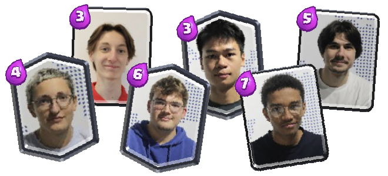

# Zappy ⚡

---

The **Zappy** project is the final project of the second year *(Tek2)* of EPITECH's bachelor academic cursus.

It is the only project in the **B-YEP-400** module which accounts for **6 credits** *(around 10% of the requirements for the year)*.

---

# Goal 🎯

The goal of the **Zappy** is to realise a complete autonomous-game environement.
The latter is composed of **3 parts**:
- The **server**: hosts the game and runs it.
- The **GUI**: allows us (users), to see the game unfold.
- The **AI**: the actual players of the game.

---

# Install 🕺

To install the **Zappy** on your own machine, you must download the source files present in this repository, and then build the project.

### Prerequisites
To build the project, you must have have:
- **GCC** with version **8 minimum**.
- **SFML** with version **2.6.1 minimum**.
- **python** installed (at least **python3**).
It is to note that **Linux** is recommended as we have not officialy ported this to **Windows**. *(Mac support is not guaranted either).

### Downloading
Before installing, you must download the sources.
- Clone the repository using GitHub's [HTTPS link](https://github.com/444leod/Zappy.git).
- Download GitHub's given [ZIP file](https://github.com/444leod/Zappy/archive/refs/heads/main.zip).
```sh
git clone https://github.com/444leod/Zappy.git
```

### Building
This project uses a **Makefile** at the root of the source files.
This Makefile uses other Makefiles to build each component individually.
To **build** the project, run:
```sh
make
```
Success messages should appear one by one.
> Be patient, building the GUI is very tideous and may take a few minutes.
Once this is done, head to the next part: **[Usage](#usage-)**.

---

# Usage 🧭

Once built (see [Install](#install-)), you can use the project in this way.

### Server
The usage of the server presents as follows.
```sh
./zappy_server -p <PORT> -x <WIDTH> -y <HEIGHT> -n <TEAMS...> -c <COUNT> -f <FREQUENCY>
```
The options are as follow:
| Option | Description                                  | Example          |
|--------|----------------------------------------------|-----------------:|
| `-p`   | The port that the server will work on        | `-p 25565`       |
| `-x`   | The width of the map                         | `-x 10`          |
| `-y`   | The height of the map                        | `-y 10`          |
| `-n`   | The names of the teams (separated by spaces) | `-n teamA teamB` |
| `-c`   | The amount of players in a team at the start | `-c 5`           |
| `-f`   | The speed at which the server runs.          | `-f 2`           |

### GUI
The usage of the GUI presents as follows:
```sh
./zappy_gui -p <PORT> [-h <MACHINE>]
```
The options are as follows:
| Option | Description                          |        Example |
|--------|--------------------------------------|---------------:|
| `-p`   | The port of the server to connect to | `-p 25565`     |
| `-h`   | **OPTIONAL** The address of the host | `-h localhost` |

### AI
The usage of the AI presents as follows:
```sh
./zappy_ai -p <PORT> -n <NAME> [-h <MACHINE>]
```
The options are as follows:
| Option | Description                           |        Example |
|--------|---------------------------------------|---------------:|
| `-p`   | The port of the server to connect to  |     `-p 25565` |
| `-n`   | The name of team the player will join |     `-n teamA` |
| `-h`   | **OPTIONAL** The address of the host  | `-h localhost` |

---

# Game 🎮

### Setting
The game takes place in a **2-dimensional** tiled map. Each side of the map connects to the other. *(Going far to the right pops you to the left...)*, on which live harmless and peaceful creatures called **Trantorians**.

### Occupations
Trantorians work in **teams**, **the last team standing wins**, and to achieve this and stay **alive**, they will need to consume **food** every now and then.
*(As you can imagine, trantorians are the players, played by the AIs)*.

### Evolutions
Trantorians also know a very ancient **ritual** passed through generations.
This ritual allows trantorians to **evolve** and become wiser and stronger.

### Reproduction
Trantorians can **self-reproduce** to expand their team.
They lay eggs that can be used by another player to join-in.

---

# Group 👥

To realise this project, we are given the opportunity to make groups of 6.
Our team is composed of:
- **Léo DUMONT** `server` `GUI` `organisation`
- **Thibault LONGUEPEE** `server`
- **Sacha POLEROWICZ** `GUI`
- **Nicolas NGUYEN** `GUI`
- **Elliot ALLADAYE** `AI`
- **Isaac LEVY-PIQUET** `AI`


